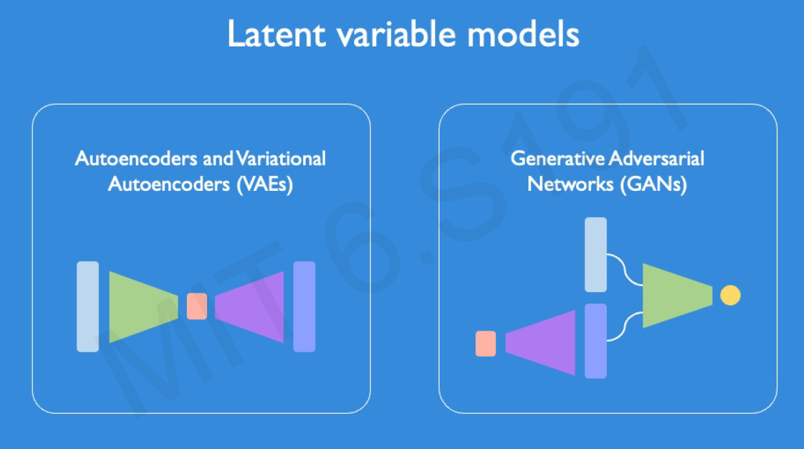
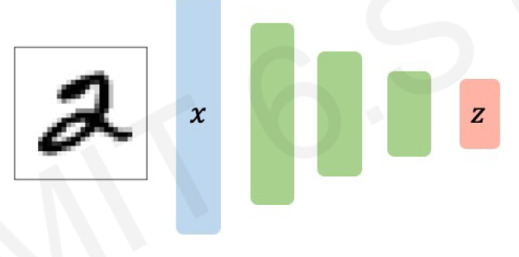
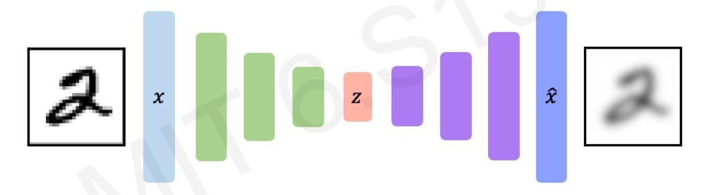
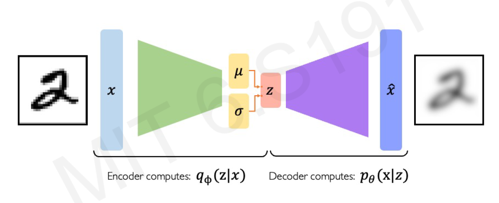
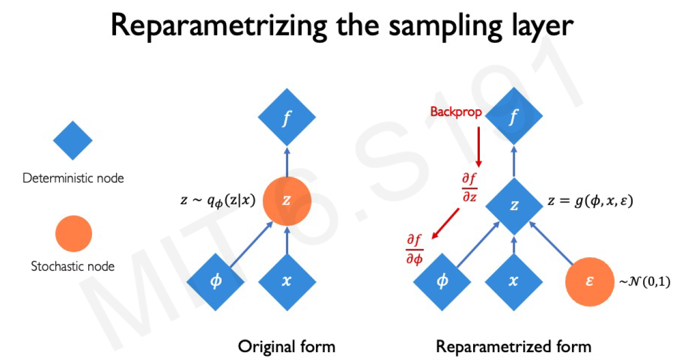
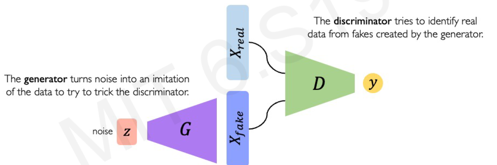

# Deep Generative Modeling

Deep generative models aim to build models based on data to generate brand new instances, following the learned distribution of the data.

## Generative Modeling

### The Main Goal:
To take input training samples from some distribution and learn a model that represents that distribution. This involves:
- **Density estimation**: Learning the probability distribution of the training data.
- **Sample generation**: Generating new samples from the learned distribution.

### Why Build Generative Models?
1. **Debiasing**: Capable of uncovering underlying features in the dataset, which helps reduce bias.
2. **Outlier Detection**: Detecting outliers helps avoid unpredictable behavior during training.

---

## Latent Variable Models
### Types of Models:
1. **Autoencoders and Variational Autoencoders (VAEs)**
   
2. **Generative Adversarial Networks (GANs)**

*Figure 1: Diagram showing types of latent variable models*

---

## Autoencoders

### Background:
Autoencoders are an unsupervised approach for learning a lower-dimensional feature representation from **unlabeled training data**.

- **Encoding**: Learns the mapping from training data $x$ to a low-dimensional latent space $z$.

*Figure 2: Diagram illustrating the encoding process*

- **Decoding**: Learns the mapping back from the latent space $z$ to reconstruct the observation $\hat{x}$.

*Figure 3: Diagram illustrating the decoding process*

### How Do We Learn the Latent Space?
We train the model to use the features of the latent space to reconstruct the original data.

> **Note**: If $x$ is the original image, then $\hat{x}$ is the reconstructed image. The loss function here doesn't use any labels (i.e., $y$).

### Loss Function:
The loss function minimizes the difference between $x$ and $\hat{x}$:

$$
\text{Loss} = \| x - \hat{x} \|
$$

> **Note**: In unsupervised learning tasks like autoencoders, the "label" is not a traditional category or output. Instead, the input itself is treated as the label for reconstruction.

---

## Dimensionality of the Latent Space and Reconstruction Quality

Autoencoding can be seen as a form of compression. A smaller latent space forces a **larger training bottleneck**, which leads to more efficient encoding of the most important features.

### Bottleneck in Autoencoders:
The bottleneck in an autoencoder is the layer where dimensionality is reduced the most (latent space layer). This forces the model to:
1. **Compress** the data, retaining important information.
2. **Reconstruct** the input as closely as possible from this compressed representation.

### Autoencoders for Representation Learning:
1. The bottleneck hidden layer forces the network to learn a compressed latent representation.
2. The reconstruction loss ensures that the latent representation captures as much "information" about the data as possible.

---

## Variational Autoencoders (VAEs)

Variational Autoencoders introduce variability into the generated data and produce different samples. To achieve this, VAEs use:
- **Mean vector (μ)**
- **Standard deviation vector (σ)**

*Figure 4: Diagram showing the structure of a Variational Autoencoder*

> **Note**: VAEs are a probabilistic twist on traditional autoencoders.

### Gaussian Distribution:
A **Gaussian distribution** is fully described by:
1. The **mean (μ)**: Determines the central value of the distribution (where most of the data is centered).
2. The **standard deviation (σ)**: Controls how spread out the data is around the mean.

By learning the **mean** and **standard deviation** for each latent variable, the VAE learns:
- The most likely range of values for the latent variable.
- The uncertainty in that range.

> **Why Gaussian Distribution?**
We assume normal distributions because they are mathematically convenient and are good approximations for many real-world data distributions.

### Sampling in VAEs:
To generate latent samples, we sample from the mean and standard deviation to compute the latent variable.

---

## VAE Optimization

1. **Encoder**: Computes the probability of $z$ given $x$.
2. **Decoder**: Computes the probability of $x$ given $z$.

### Loss Function:
The VAE loss function consists of two terms:

$$
\text{Loss} = (\text{Reconstruction Loss}) + (\text{Regularization Term})
$$

- **Reconstruction Loss**: Same as in traditional autoencoders $(x - \hat{x})$.
- **Regularization Term**: Measures how close the learned latent distribution is to the prior distribution (typically a normal distribution).

The regularization term involves computing the **KL Divergence**, which calculates the distance between the inferred latent distribution and the prior latent distribution.

### Choosing the Prior:
A common choice of prior is a **normal Gaussian distribution**:
- Mean = 0
- Standard deviation = 1

This encourages the encoded data points to distribute evenly around the center of the latent space.

---

### KL Divergence:

$$
D_{KL}(q(z|x) || p(z)) = \int q(z|x) \log \left( \frac{q(z|x)}{p(z)} \right) dz
$$

Where:
- $q(z|x)$ is the learned latent distribution.
- $p(z)$ is the prior distribution (often $\mathcal{N}(0, I)$).

---

## Intuition on Regularization and the Normal Prior

Regularization with a normal prior helps achieve two important properties:
1. **Continuity**: Points that are close in the latent space should result in similar content after decoding.
2. **Completeness**: Sampling from the latent space should result in meaningful content after decoding.

> Without regularization, we sacrifice these properties.

### Reparameterization Trick:
We can't backpropagate through the sampling layers due to the presence of the mean and standard deviation. The reparameterization trick helps by rewriting the sampling process to be differentiable.

*Figure 5: Diagram illustrating the reparameterization trick*

---

## Latent Perturbation in VAEs

Gradually increasing or decreasing a single latent variable (while keeping others fixed) will affect specific interpretable features in the decoded output. Each dimension in $z$ encodes different features.

---

## Latent Space Disentanglement with Beta-VAEs
**Beta-VAEs** are a variant of VAEs that introduce an extra hyperparameter $\beta$ to control the trade-off between the reconstruction loss and the regularization term. By adjusting $\beta$, we can achieve better disentanglement of the latent features.

---

## Why Latent Variable Models?

1. **Debiasing**: Latent variable models can help identify and mitigate biases in the dataset.
2. **Outlier Detection**: They can detect unusual or outlier data points, reducing the risk of unpredictable behavior during training.

---

## Generative Adversarial Networks (GANs)

**GANs** are another type of generative model where two neural networks, a **generator** and a **discriminator**, compete with each other.

- **Generator**: Tries to create realistic data instances.
- **Discriminator**: Tries to distinguish between real and generated data.

*Figure 6: Diagram showing the structure of a Generative Adversarial Network*

The process continues until the discriminator can no longer tell the difference between real and generated data.

---

## Conditional GANs

Conditional GANs add **conditional information** (like class labels) to both the generator and the discriminator. This allows GANs to generate specific types of data based on the condition provided.

---

## Pix2Pix and Paired Translation

Pix2Pix is a conditional GAN model used for **paired image-to-image translation**, where the goal is to transform one type of image into another, e.g., converting a sketch into a realistic photo.